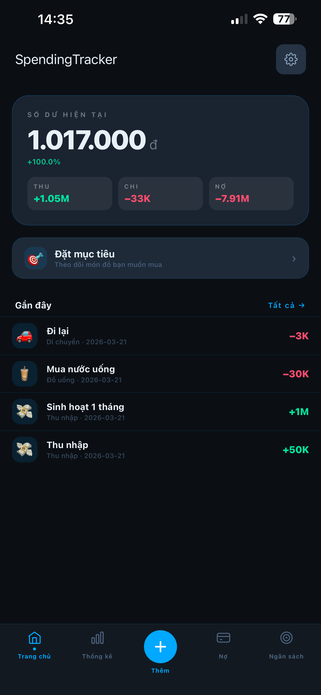

# 💰 Spending Tracker - Ứng Dụng Quản Lý Tài Chính Cá Nhân

Chào mừng bạn đến với **Spending Tracker**! Đây là một ứng dụng quản lý tài chính cá nhân đơn giản, trực quan, giúp bạn dễ dàng theo dõi dòng tiền, kiểm soát ngân sách và quản lý các khoản vay nợ một cách hiệu quả.

---

## ✨ Tính năng nổi bật

- 📝 **Ghi chép nhanh chóng**: Dễ dàng thêm các khoản thu/chi hàng ngày chỉ với vài thao tác.
- 📊 **Thống kê trực quan (Stats)**: Xem báo cáo tổng quan về tình hình tài chính của bạn qua các biểu đồ dễ hiểu.
- 🎯 **Quản lý ngân sách (Budget)**: Đặt ra giới hạn chi tiêu cho từng danh mục để tránh việc "vung tay quá trán".
- 🤝 **Theo dõi vay/nợ (Debt)**: Ghi nhớ các khoản tiền bạn cho mượn hoặc đang nợ người khác, giúp bạn quản lý dòng tiền tốt hơn.
- 🌙 **Hỗ trợ Giao diện Tối/Sáng**: Tự động tùy chỉnh theo sở thích của bạn.

---

## 📱 Nền tảng hỗ trợ

⚠️ **Lưu ý quan trọng:** Hiện tại, ứng dụng **chỉ mới hỗ trợ hệ điều hành Android**. Phiên bản dành cho **iOS (iPhone/iPad)** vẫn đang trong quá trình nghiên cứu, phát triển và sẽ được ra mắt trong tương lai. 

---

## 📥 Hướng dẫn cài đặt (Dành cho Android)

Do ứng dụng hiện tại đang trong giai đoạn phát triển và chưa được đưa lên Google Play Store, bạn có thể cài đặt trực tiếp thông qua file `.apk` theo các bước sau:

1. **Tải file APK**: Truy cập vào mục [Releases](../../releases) (hoặc chèn link tải Google Drive của bạn vào đây) và tải xuống file `SpendingTracker.apk` mới nhất.
2. **Cho phép cài đặt ứng dụng không rõ nguồn gốc**: 
   - Vào **Cài đặt (Settings)** > **Bảo mật (Security)** (hoặc Ứng dụng).
   - Bật tùy chọn **Cài đặt ứng dụng không rõ nguồn gốc (Install unknown apps)** cho trình duyệt hoặc trình quản lý file của bạn.
3. **Cài đặt**: Mở file `.apk` vừa tải về và chọn **Cài đặt (Install)**.
4. **Mở ứng dụng**: Sau khi cài đặt xong, bạn có thể mở ứng dụng lên và bắt đầu quản lý tài chính của mình!

---

## 🚀 Hướng dẫn sử dụng cơ bản

1. **Thêm giao dịch mới**: Nhấn vào nút **"+"** (hoặc tab Thêm mới) trên màn hình chính để nhập số tiền, chọn danh mục (Ăn uống, Đi lại, Lương...) và ghi chú.
2. **Xem thống kê**: Chuyển sang tab **Thống kê** để xem biểu đồ chi tiêu trong tháng.
3. **Thiết lập ngân sách**: Chuyển sang tab **Ngân sách** để tạo các hạn mức chi tiêu cho tháng này.
4. **Ghi nhận khoản nợ**: Sử dụng tab **Vay/Nợ** để thêm thông tin người vay/cho vay và số tiền tương ứng.

---

## 📸 Ảnh chụp màn hình

*(Bạn hãy thay thế các link dưới đây bằng ảnh chụp màn hình thực tế từ ứng dụng của bạn nhé)*

| Màn hình chính | Thêm giao dịch | Thống kê | Quản lý vay/nợ |
| :---: | :---: | :---: | :---: |
|  |  |  |  |

---

## 💬 Phản hồi và Góp ý

Ứng dụng vẫn đang trong quá trình hoàn thiện. Nếu bạn gặp bất kỳ lỗi nào (bug) hoặc có ý tưởng muốn đóng góp để ứng dụng tốt hơn, vui lòng:
- Tạo một **Issue** mới trên kho lưu trữ (Repository) này.
- Hoặc liên hệ trực tiếp với nhà phát triển qua email: *utena.lg1411@gmail.com*

Cảm ơn bạn đã tin tưởng và sử dụng Spending Tracker! ❤️