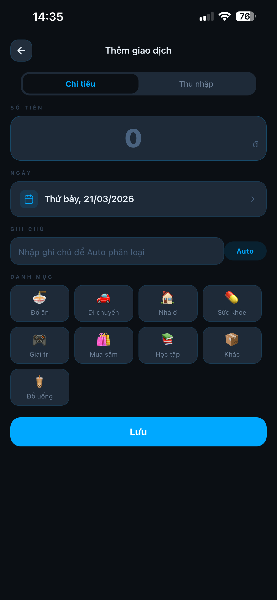
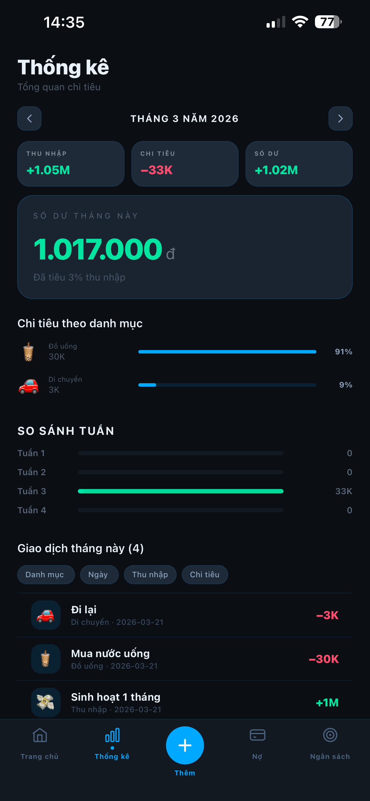
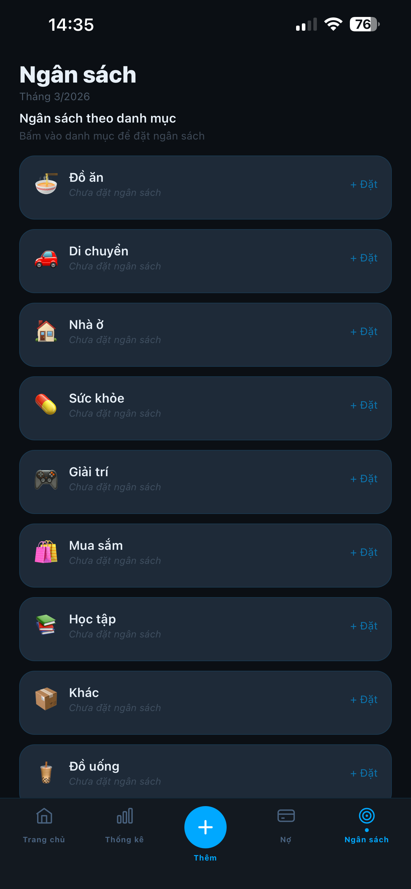
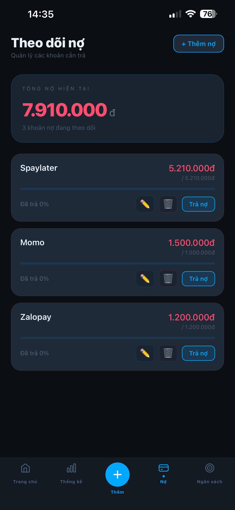
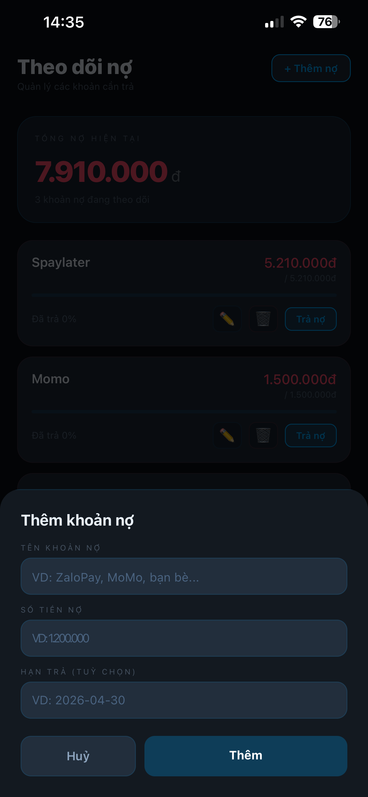
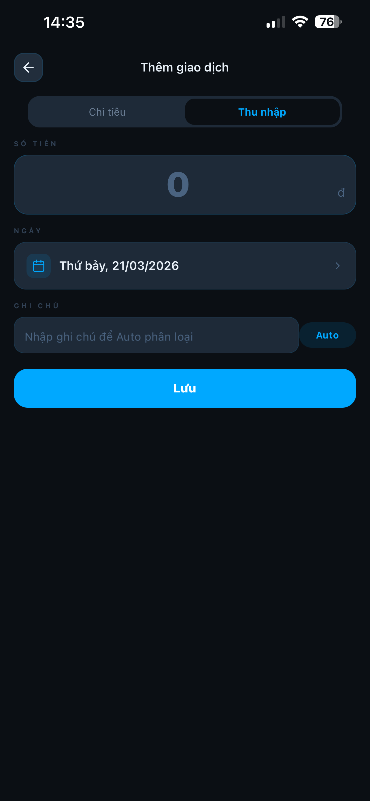
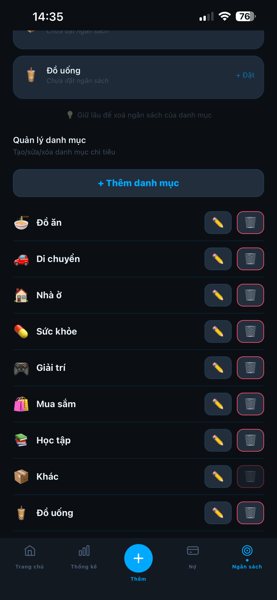
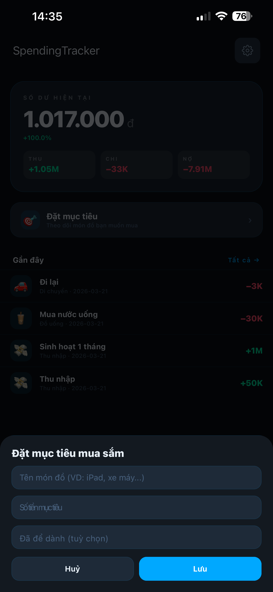
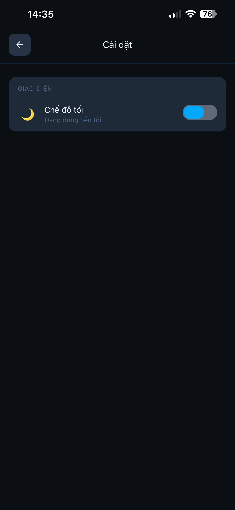

# Spending Tracker

**Spending Tracker** là ứng dụng quản lý tài chính cá nhân trên điện thoại: ghi thu — chi hằng ngày, xem tổng quan và biểu đồ, đặt ngân sách theo danh mục, và theo dõi các khoản cho vay hoặc đang nợ. Giao diện hỗ trợ **chế độ sáng / tối**, thao tác gọn để bạn nắm dòng tiền mà không bị rối.

Mục tiêu của app là một nơi duy nhất để **nhập liệu nhanh**, **nhìn lại chi tiêu theo thời gian**, và **nhắc giới hạn** trước khi vượt ngân sách.

---

## Tính năng chính

- **Ghi giao dịch nhanh**: số tiền, danh mục (ăn uống, đi lại, lương…), ghi chú.
- **Thống kê**: biểu đồ và tổng hợp theo khoảng thời gian.
- **Ngân sách**: đặt hạn mức chi theo danh mục trong tháng.
- **Vay / nợ**: theo dõi từng khoản, tiến độ trả, thêm / sửa / xoá.
- **Mục tiêu mua sắm**: đặt món đồ cần mua, số tiền mục tiêu và phần đã tích luỹ (từ trang chủ).
- **Giao diện**: tiếng Việt; chế độ sáng / tối trong Cài đặt.

---

## Giao diện ứng dụng

Ứng dụng dùng **tiếng Việt**, bố cục quen thuộc trên mobile: thanh điều hướng dưới cùng (Trang chủ, Thống kê, Thêm, Nợ, Ngân sách), thẻ tổng quan và form nhập liệu rõ ràng. Các ảnh dưới đây lấy từ [`assets/screenshots`](assets/screenshots).

| Trang chủ — số dư, thu / chi / nợ, giao dịch gần đây | Thêm giao dịch — chi tiêu, danh mục, gợi ý Auto phân loại |
| :---: | :---: |
|  |  |

| Thống kê — theo tháng, biểu đồ & lọc giao dịch | Ngân sách — đặt hạn mức theo danh mục |
| :---: | :---: |
|  |  |

| Theo dõi nợ — tổng nợ và từng khoản | Thêm khoản nợ |
| :---: | :---: |
|  |  |

| Thêm giao dịch — thu nhập | Ngân sách — quản lý danh mục |
| :---: | :---: |
|  |  |

| Đặt mục tiêu mua sắm | Cài đặt — chế độ sáng / tối |
| :---: | :---: |
|  |  |

---

## Nền tảng

Hiện **ưu tiên Android**. Bản cho iOS có thể được bổ sung sau.

---

## Cài đặt bản APK (người dùng)

1. Tải **APK** mới nhất từ [Releases](https://github.com/longnhx1/spending-tracker/releases) (hoặc nguồn phát hành của bạn).
2. Trên máy Android: cho phép cài ứng dụng từ nguồn tương ứng (trình duyệt / quản lý file).
3. Mở file APK và cài đặt.

---

## Chạy mã nguồn (lập trình viên)

Cần [Node.js](https://nodejs.org/) (LTS), npm và môi trường [Expo](https://docs.expo.dev/); Android Studio nếu build native.

```bash
git clone https://github.com/longnhx1/spending-tracker.git
cd spending-tracker
npm install
cp .env.example .env   # Windows: copy .env.example .env
```

Điền trong **`.env`**: `EXPO_PUBLIC_SUPABASE_URL` và `EXPO_PUBLIC_SUPABASE_ANON_KEY` (Supabase → Project Settings → API).

```bash
npx expo start
```

---

## Git và bảo mật — không commit

| Loại | Ghi chú |
|------|--------|
| `.env`, `.env.local`, `.env.*` (trừ `.env.example`) | Khóa API / Supabase |
| `google-services.json`, `GoogleService-Info.plist` | Firebase (nếu có) |
| `keystore.properties`, `release.keystore`, `upload-keystore.jks`, `*.pepk` | Ký bản phát hành |
| `credentials.json` (EAS) | Bí mật build Expo |

**`.env.example`** không chứa giá trị thật — an toàn khi push.

Khi cài lại máy: clone / pull, `npm install`, tạo lại `.env` (lưu secret riêng, ví dụ password manager).

---

## Sử dụng nhanh trong app

1. **Thêm giao dịch**: tab **+** — nhập số tiền, chọn danh mục và ghi chú.
2. **Thống kê**: xem tổng hợp và biểu đồ.
3. **Ngân sách**: đặt hạn mức theo danh mục.
4. **Vay / nợ**: cập nhật các khoản liên quan.

---

## Phản hồi

Báo lỗi hoặc góp ý: tạo **Issue** trên repo hoặc email *utena.lg1411@gmail.com*.

Cảm ơn bạn đã quan tâm tới Spending Tracker.
